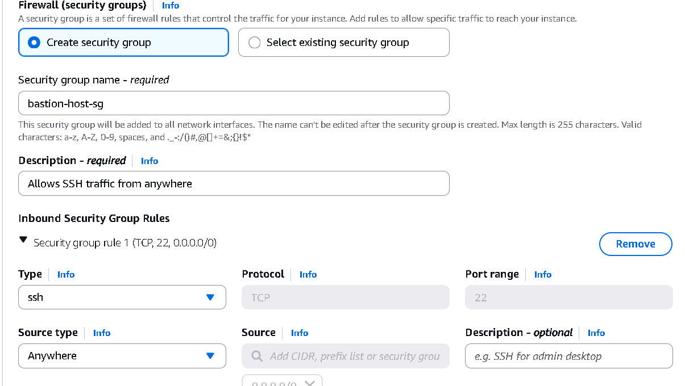
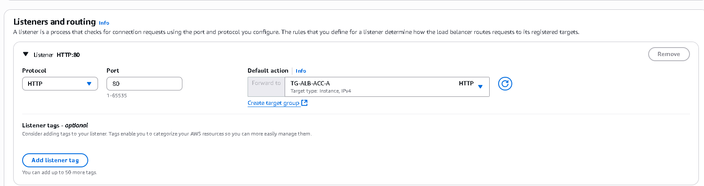
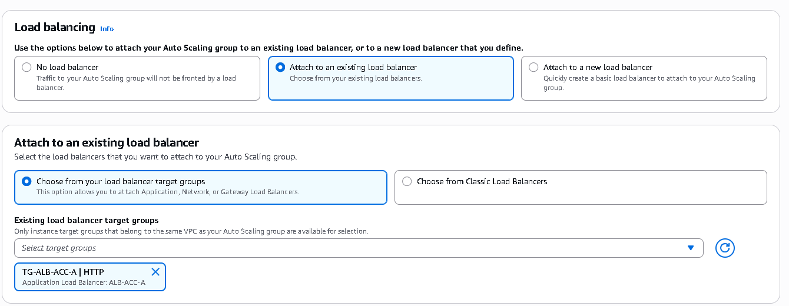
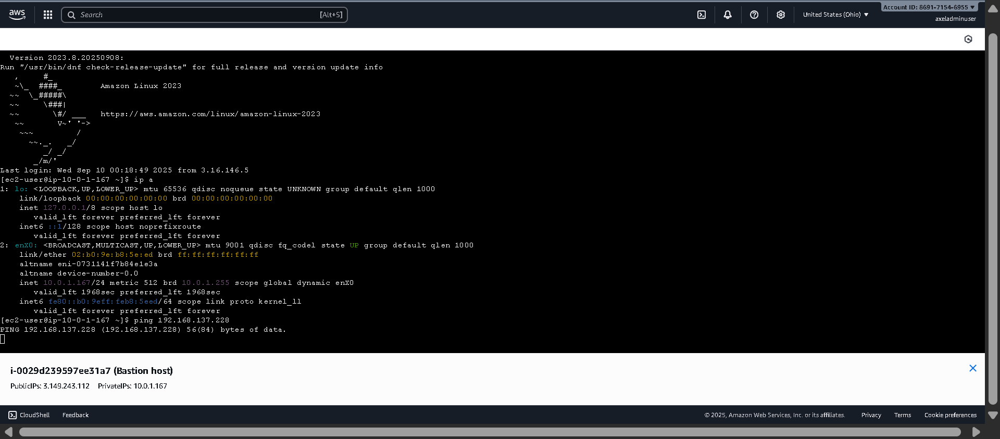

# ☁ AWS-VPC---Multi-Account-Secure-Networking
This repository documents how I designed and deployed a network architecture on AWS that includes multi-account VPCs, secure connectivity via VPC Peering, Bastion Hosts, S3 Endpoints, and monitoring using VPC Flow Logs stored in a centralized bucket in Account A. The goal is to create a secure, scalable, and production-ready environment, ideal as a foundation for enterprise workloads.

 
<!-- -------------------------------------------------- -->
⚙ Tech Stack
<!-- -------------------------------------------------- -->
• 🖥 Amazon EC2 – Public and Private Instances
<!-- -------------------------------------------------- -->
• ☁ Amazon VPC – Public and Private Subnets
<!-- -------------------------------------------------- -->
• 🌐 Internet Gateway (IGW) & NAT Gateway – Public and Private Connectivity
<!-- -------------------------------------------------- -->
• 🔐 IAM Roles & Policies – Cross-Account Security
<!-- -------------------------------------------------- -->
• 🧱 Security Groups & NACLs – Traffic Control
<!-- -------------------------------------------------- -->
• 🔁 VPC Peering – Cross-Account VPC Communication
<!-- -------------------------------------------------- -->
• 📦 Amazon S3 – Centralized Cross-Account Log Bucket
<!-- -------------------------------------------------- -->
• 📊 CloudWatch Logs – Centralized Monitoring
<!-- -------------------------------------------------- -->
• 🛡 Bastion Host – Secure Access to Private Instances
<!-- -------------------------------------------------- -->
⸻
📚 *Table of Contents*

<!-- -------------------------------------------------- -->
### Account A
<!-- -------------------------------------------------- -->
1. 🏗 [Create VPC with Public and Private Subnets](#create-vpc-with-public-and-private-subnets)  
<!-- -------------------------------------------------- -->
2. 🖥 [Launch Test Instance (Future Bastion Host)](#launch-test-instance-future-bastion-host)  
<!-- -------------------------------------------------- -->
3. 📦 [Create Custom AMI from Test Instance (with HTTP, etc.)](#create-custom-ami-from-test-instance-with-http-etc)  
<!-- -------------------------------------------------- -->
4. 🔐 [Configure Security Groups (SGs)](#configure-security-groups-sgs)
<!-- -------------------------------------------------- -->
   - SG for ELB and SG for Private Instances (allowing ELB and SSH from test instance)
<!-- -------------------------------------------------- --> 
6. ⚖ [Configure Application Load Balancer)](#configure-application-load-balancer)  
<!-- -------------------------------------------------- -->
7. ⚙ [Create Launch Template for Auto Scaling Group (ASG)](#create-launch-template-for-auto-scaling-group-asg)  
<!-- -------------------------------------------------- -->
   - Instance Type: t2.micro  
<!-- -------------------------------------------------- -->
   - Custom AMI  
<!-- -------------------------------------------------- -->
   - Associated Security Group
<!-- -------------------------------------------------- -->
8. 📈 [Create Auto Scaling Group (ASG)](#create-auto-scaling-group-asg)  
<!-- -------------------------------------------------- -->
   - Minimum 1 instance  
<!-- -------------------------------------------------- -->
   - Maximum 3 instances  
<!-- -------------------------------------------------- -->
   - Associate with ELB  
<!-- -------------------------------------------------- -->

### Account B
8. 🏗 [Create VPC B](#create-vpc-b)  
<!-- -------------------------------------------------- -->
9. 🛡🖥 [Launch Bastion Host (Public Subnet) and Private Instance (Private Subnet) in Same AZ](#launch-bastion-host-public-subnet-and-private-instance-private-subnet-in-same-az)
<!-- -------------------------------------------------- -->

### Cross-Account Connectivity
<!-- -------------------------------------------------- -->
10. 🔗 [Create VPC Peering Between Account A and B](#create-vpc-peering-between-account-a-and-b)  
<!-- -------------------------------------------------- -->
11. 🛣 [Update Route Tables to Allow Communication](#update-route-tables-to-allow-communication)  
<!-- -------------------------------------------------- -->
12. ✅ [Test Connectivity from Private Instances Using Bastion (Private IPs)](#test-connectivity-from-private-instances-using-bastion-private-ips)  
<!-- -------------------------------------------------- -->
### VPC Endpoint
<!-- -------------------------------------------------- -->
13. 🌐 [Connect Private Instance to S3 via VPC Endpoint](#connect-private-instance-to-s3-via-vpc-endpoint)  
<!-- -------------------------------------------------- -->
### Logs and Cross-Account Roles
<!-- -------------------------------------------------- -->
14. 📦 [Create S3 Bucket in Account A](#create-s3-bucket-in-account-a)  
<!-- -------------------------------------------------- -->
15. 🔐 [Allow Access from Account B via Policy](#allow-access-from-account-b-via-policy)  
<!-- -------------------------------------------------- -->
16. 📊 [Create VPC Flow Log in Account B](#create-vpc-flow-log-in-account-b)  
<!-- -------------------------------------------------- -->
17. 🔄 [Generate Traffic via Bastion (Ping)](#generate-traffic-via-bastion-ping)  
<!-- -------------------------------------------------- -->
18. 📜 [Verify Traffic Logs Written in Account A Bucket](#verify-traffic-logs-written-in-account-a-bucket)
<!-- -------------------------------------------------- -->
⸻
### IMPORTANT:
In this section, I’m going to explain how I built a VPC project from scratch to its final stage.
<!-- -------------------------------------------------- -->
(Comment before you read this document: I created this project for people who already know how AWS works, so I won’t go too deep into details. It is a project for studying and understanding VPCs, cross-account, and cross-region infrastructures.)
<!-- -------------------------------------------------- -->
⸻

## Create VPC with Public and Private Subnets

⸻
<!-- -------------------------------------------------- -->
First, we must set up Account A, so let’s get started.
<!-- -------------------------------------------------- -->
In Account A, we are going to create a VPC called “VPC ACC A”. We will use the 10.0.0.0/16 CIDR, which provides around 65,536 IPs. We won’t use IPv6 for this project.
<!-- -------------------------------------------------- -->
  
<!-- -------------------------------------------------- -->
Note: Tenancy determines how our instances are placed on hardware. If we choose Default, we will share hardware with other AWS customers. If we choose Dedicated, we will have isolated hardware.
<!-- -------------------------------------------------- -->
Since this is a demo, we will use default tenancy, which is much cheaper.
<!-- -------------------------------------------------- -->
⸻

In the next VPC settings, we will configure subnets. A subnet is a division of our VPC where we will deploy resources.
<!-- -------------------------------------------------- -->
We will create 2 public subnets and 2 private subnets.
<!-- -------------------------------------------------- -->
We can leave the Customize subnet CIDR blocks to AWS, but change the /20 to /24, giving us 256 IPs per subnet.
<!-- -------------------------------------------------- -->
Note: AWS reserves some IPs in every subnet—the first four and the last one.
<!-- -------------------------------------------------- -->
The following IPs are reserved by AWS:
	•	10.0.0.0 Network address
	•	10.0.0.1 VPC router
	•	10.0.0.2 Amazon-provided DNS
	•	10.0.0.3 Reserved for future use
	•	10.0.0.255 Network broadcast (AWS does not support broadcast in a VPC)
<!-- -------------------------------------------------- -->
  
<!-- -------------------------------------------------- -->
We won’t use NAT Gateways or VPC Endpoints in this VPC.
<!-- -------------------------------------------------- -->
⸻
<!-- -------------------------------------------------- -->
Now our VPC has been created:
<!-- -------------------------------------------------- -->
  
<!-- -------------------------------------------------- -->
This is a diagram of our VPC provided by AWS:
<!-- -------------------------------------------------- -->
  
<!-- -------------------------------------------------- -->
⸻

## Launch Test Instance (Future Bastion Host)
<!-- -------------------------------------------------- -->
Next, we will launch an EC2 instance within our VPC to test connectivity.
<!-- -------------------------------------------------- -->
We will call it “Bastion Host”, because this instance will help us troubleshoot future instances in private subnets.
<!-- -------------------------------------------------- -->
We will use an Amazon Linux AMI as the operating system.
<!-- -------------------------------------------------- -->
  
<!-- -------------------------------------------------- -->
Note: We will also create a custom AMI from this Bastion Host for future private instances.
<!-- -------------------------------------------------- -->
⸻

For the Instance Type, we will use t2.micro and proceed without a key pair.
<!-- -------------------------------------------------- -->
  
<!-- -------------------------------------------------- -->
⸻

In Networking settings, we select the VPC created earlier and choose a public subnet for the Bastion Host. Enable auto-assign public IP if it is not already enabled.
<!-- -------------------------------------------------- -->
  
<!-- -------------------------------------------------- -->
⸻

Next, we create a Security Group (SG), which acts as a firewall for our EC2 instances. An SG is stateful, so if inbound traffic is allowed, the corresponding outbound traffic is automatically allowed.
<!-- -------------------------------------------------- -->
We will name the SG “Bastion-host-sg” and allow SSH from anywhere (0.0.0.0/0). Since this is a demo, we allow all IPs; in a real scenario, you would restrict SSH access to specific IP ranges.
<!-- -------------------------------------------------- -->
  
<!-- -------------------------------------------------- -->
Note: In production, I recommend using separate SGs: one for SSH access and another for services like HTTP. Open SSH ports can be a serious security risk.
<!-- -------------------------------------------------- -->
⸻

At the bottom, there is the User Data script option.
<!-- -------------------------------------------------- -->
A User Data script is executed on the first boot of the instance with sudo permissions. It’s commonly used to install software, update packages, and automate tasks.
<!-- -------------------------------------------------- -->
We will use it to update packages and start an HTTP endpoint.
<!-- -------------------------------------------------- -->
  
<!-- -------------------------------------------------- -->
This completes the EC2 instance setup. We will launch it and connect via EC2 Instance Connect.
<!-- -------------------------------------------------- -->
⸻

In EC2 Instance Connect, we test Internet connectivity using the ping command.
<!-- -------------------------------------------------- -->
  
<!-- -------------------------------------------------- -->
Packets successfully go back and forth, confirming the EC2 instance has Internet access.
<!-- -------------------------------------------------- -->
⸻

Next, we try to access our HTTP endpoint using the instance’s public IP:
<!-- -------------------------------------------------- -->
http://<public-instance-ip>
<!-- -------------------------------------------------- -->
  
<!-- -------------------------------------------------- -->
We initially cannot access the HTTP endpoint.
<!-- -------------------------------------------------- -->
Note: Timeouts or failed HTTP/SSH connections are usually caused by Security Groups or NACLs. Let’s check our SG.
<!-- -------------------------------------------------- -->
⸻

Fixing HTTP access:
<!-- -------------------------------------------------- -->
We open the HTTP port from anywhere in our SG. HTTP traffic must be explicitly allowed.
<!-- -------------------------------------------------- -->
  
<!-- -------------------------------------------------- -->
Now the HTTP page is accessible:
<!-- -------------------------------------------------- -->
  
<!-- -------------------------------------------------- -->
⸻

<!-- -------------------------------------------------- -->
## Create Custom AMI from Test Instance (with HTTP, etc.)
<!-- -------------------------------------------------- -->
⸻
<!-- -------------------------------------------------- -->
Next, we create a custom AMI from our Bastion Host for future use:
<!-- -------------------------------------------------- -->
  
<!-- -------------------------------------------------- -->
We will call it “AMI-demo” or “AMI-Image-demo” with the description “Launch template AMI”.
<!-- -------------------------------------------------- -->
  
<!-- -------------------------------------------------- -->
⸻
<!-- -------------------------------------------------- -->
## Configure Security Groups (SGs)
<!-- -------------------------------------------------- -->
Before creating an Application Load Balancer (ALB) and Auto Scaling Group (ASG), we create SGs for both:
	•	ALB SG: Allow HTTP from anywhere.
<!-- -------------------------------------------------- -->
  
<!-- -------------------------------------------------- -->
	•	Instance SG: Allow HTTP only from ALB SG and SSH only from Bastion SG.
<!-- -------------------------------------------------- -->
  
<!-- -------------------------------------------------- -->
## Configure Application Load Balancer
<!-- -------------------------------------------------- -->
Create the Application Load Balancer:
	•	Name: ALB-ACC-A
	•	Scheme: Default
	•	IP Type: IPv4
<!-- -------------------------------------------------- -->
  
<!-- -------------------------------------------------- -->
Select VPC and public subnets:
<!-- -------------------------------------------------- -->
  
<!-- -------------------------------------------------- -->
Attach the ALB SG created earlier:
<!-- -------------------------------------------------- -->
  
<!-- -------------------------------------------------- -->
Create the Target Group:
	•	Name: TG-ALB-ACC-A
	•	Protocol: HTTP
	•	IP Type: IPv4
<!-- -------------------------------------------------- -->
  
<!-- -------------------------------------------------- -->
Note: A Target Group is a set of instances, Lambda functions, IP addresses, or other endpoints that the ALB routes traffic to.
<!-- -------------------------------------------------- -->
Target Group associated:
<!-- -------------------------------------------------- -->
  
<!-- -------------------------------------------------- -->
Launch the ALB:
<!-- -------------------------------------------------- -->
  
<!-- -------------------------------------------------- -->
## Create Launch Template for Auto Scaling Group (ASG)
<!-- -------------------------------------------------- -->
Now we configure the ASG:
	•	Name: ASG-ACC-A
<!-- -------------------------------------------------- -->
Create a Launch Template:
<!-- -------------------------------------------------- -->
  
<!-- -------------------------------------------------- -->
Launch Template configurations:
	•	AMI Image
	•	Instance type: t2.micro
	•	Subnet/availability zone
	•	Key pair
	•	Security Group
	•	User Data script
<!-- -------------------------------------------------- -->
⸻
<!-- -------------------------------------------------- -->
Create ASG Template:
	•	Name: ASG-TEMPLATE
	•	AMI: AMI-demo
<!-- -------------------------------------------------- -->
  
<!-- -------------------------------------------------- -->
Note: Preloaded AMI ensures instances have HTTP configured, even if they are private.
<!-- -------------------------------------------------- -->
⸻
<!-- -------------------------------------------------- -->
Create a key pair:
	•	Name: bastion-ssh
	•	Format: PEM
<!-- -------------------------------------------------- -->
  
<!-- -------------------------------------------------- -->
Private key is kept by us; public key is on the instance to enable SSH access.
<!-- -------------------------------------------------- -->
⸻

Select t2.micro, assign private instance SG, and add User Data script to start HTTP.
<!-- -------------------------------------------------- -->
  
<!-- -------------------------------------------------- -->
  
<!-- -------------------------------------------------- -->
Now, the Launch Template is ready and associated with the ASG.
<!-- -------------------------------------------------- -->
⸻
## Create Auto Scaling Group (ASG)
Configure network settings:
	•	VPC
	•	Private subnets
 <!-- -------------------------------------------------- -->
  
<!-- -------------------------------------------------- -->
Attach the ALB under load balancing:
<!-- -------------------------------------------------- -->
  
<!-- -------------------------------------------------- -->
Set ASG capacity:
	•	Min: 1
	•	Max: 3
	•	Target tracking: CPU utilization 50%
<!-- -------------------------------------------------- -->
  
⸻
<!-- -------------------------------------------------- -->
ASG deploys instances using the Launch Template:
<!-- -------------------------------------------------- -->
  
<!-- -------------------------------------------------- -->
Target group shows the new instance registered:
<!-- -------------------------------------------------- -->
  
<!-- -------------------------------------------------- -->
⸻
<!-- -------------------------------------------------- -->
We can now access HTTP endpoints using the ALB DNS, which forwards requests to private instances.
<!-- -------------------------------------------------- -->
Now, using the DNS name of our ALB, we can access the HTTP page hosted on our private instances. Since we previously configured the Security Group to allow HTTP traffic only from the ALB, 
<!-- -------------------------------------------------- -->
this is the only valid path to reach the content.
<!-- -------------------------------------------------- -->
  
<!-- -------------------------------------------------- -->
⸻
<!-- -------------------------------------------------- -->
Next, I demonstrate that our Bastion Host can connect to the private instances.
<!-- -------------------------------------------------- -->
First, I verified connectivity by running a ping command from the Bastion Host to confirm it has access to the internet.
<!-- -------------------------------------------------- -->
Then, I established an SSH connection to the private instance using the following command:
<!-- -------------------------------------------------- -->
```bash
ssh -i bastion-ssh.pem ec2-user@<private-instance-ip>
```
<!-- -------------------------------------------------- -->
  
<!-- -------------------------------------------------- -->
As shown, the SSH connection was successful. From the private instance, running a ping command confirms that it does not have direct internet access.
<!-- -------------------------------------------------- -->
However, the HTTP endpoint remains fully functional because the AMI was preconfigured with all the required software and dependencies prior to deployment.
<!-- -------------------------------------------------- -->


### Account B
<!-- -------------------------------------------------- -->
## Create VPC B
<!-- -------------------------------------------------- -->
The next part of this project will show how I set up another VPC, but in a different account.
<!-- -------------------------------------------------- -->
We will call it “VPC-ACC-B”.
<!-- -------------------------------------------------- -->
The CIDR will be 192.168.0.0/16. By using this IP range, I ensure that when we later set up VPC peering, the CIDRs do not overlap. As before, we will not use IPv6, and tenancy will remain the default.
<!-- -------------------------------------------------- -->
  
<!-- -------------------------------------------------- -->
⸻

For the Availability Zones (AZs) configuration, I will use only 1 AZ with 2 subnets within it. Since this demo is focused on showing how to peer two VPCs and connect a VPC endpoint to S3 and a private instance, a single AZ is sufficient.
<!-- -------------------------------------------------- -->
  
<!-- -------------------------------------------------- -->
⸻
<!-- -------------------------------------------------- -->
## Launch Bastion Host (Public Subnet) and Private Instance (Private Subnet) in Same AZ
<!-- -------------------------------------------------- -->
⸻
<!-- -------------------------------------------------- -->
Next, we will create a Bastion Host Security Group in this account, allowing SSH access from anywhere.
<!-- -------------------------------------------------- -->
  
<!-- -------------------------------------------------- -->
⸻
<!-- -------------------------------------------------- -->
We will also create a Security Group for our private instance, which allows SSH traffic only from the Bastion Host SG.
<!-- -------------------------------------------------- -->
  
<!-- -------------------------------------------------- -->
⸻
<!-- -------------------------------------------------- -->
Now, we will launch our Bastion Host with the following configuration:
<!-- -------------------------------------------------- -->
 
<!-- -------------------------------------------------- -->
  
<!-- -------------------------------------------------- -->
Then, we will launch a private instance with the following configuration:
<!-- -------------------------------------------------- -->
  
<!-- -------------------------------------------------- -->
  
<!-- -------------------------------------------------- -->
  
<!-- -------------------------------------------------- -->
I won’t go into all the previous setup details, as they were already covered earlier in this project. Instead, let’s focus on something new: SSH access to our Bastion Host.
<!-- -------------------------------------------------- -->
First, let’s run a ping command to validate that the Bastion Host has internet connectivity.
<!-- -------------------------------------------------- -->
  
<!-- -------------------------------------------------- -->
As you can see, we have internet access. Next, using the .pem file downloaded previously, I will add the private key to the Bastion Host. Without this key, we cannot access the private instance.
<!-- -------------------------------------------------- -->
After pasting the command, we save it in vim using :wq.
<!-- -------------------------------------------------- -->
  
<!-- -------------------------------------------------- -->
Next, before SSH-ing into the private instance, we must adjust the permissions of the .pem file using chmod, which is used in Linux to manage file permissions.
<!-- -------------------------------------------------- -->
Now, we SSH into our private instance.
<!-- -------------------------------------------------- -->
  
<!-- -------------------------------------------------- -->
Here we go — the setup is complete. If we run a ping command on the private instance, we will see that it does not have internet access.
<!-- -------------------------------------------------- -->
Everything is ready. Let’s now move on to the VPC peering connection.
<!-- -------------------------------------------------- -->

### Cross-Account Connectivity
<!-- -------------------------------------------------- -->
## Create VPC Peering Between Account A and B
<!-- -------------------------------------------------- -->
Now, let’s go back to our Account A, and under the VPC Peering Connections section we are going to create one called “VPC A | VPC B”.
We will select our VPC, choose Another account, paste the Account ID in the blank field, and select Another region.
<!-- -------------------------------------------------- -->
  
<!-- -------------------------------------------------- -->
Here, I’m making sure it’s the same region as my VPC in Account B (us-east-1), and I will paste the VPC ID from my Account B VPC.
<!-- -------------------------------------------------- -->
⸻

In Account B, under the same configurations, I can validate that there is a request pending, so I will go ahead and accept it.
<!-- -------------------------------------------------- -->
  
<!-- -------------------------------------------------- -->
Now we have successfully set up our cross-region and cross-account VPC peering connection. But don’t get too excited—although the peering connection is established, there are still some critical steps left.
<!-- -------------------------------------------------- -->
## Update Route Tables to Allow Communication
<!-- -------------------------------------------------- -->
Now we are going to edit an important part of our VPC called Route Tables, which work like a GPS inside the VPC. They provide the routing instructions that tell the traffic where to go. By default, when creating a VPC with AWS-provided configurations, AWS automatically manages the route tables.
<!-- -------------------------------------------------- -->
However, if we create our VPC without these options, we must configure the route tables manually. Here’s an important note:
<!-- -------------------------------------------------- -->
Within a VPC we may have public subnets, but how do they reach the internet? This happens through an Internet Gateway (IGW). Still, if we don’t explicitly configure the public subnet’s route table to have a route to this IGW, then traffic cannot leave the VPC.
<!-- -------------------------------------------------- -->
A subnet is considered public only when it has a route in its route table pointing to an Internet Gateway.
<!-- -------------------------------------------------- -->
  
<!-- -------------------------------------------------- -->
As you can see, I configured the VPC peering route in the route table, and by default AWS already set up the IGW route table. If this is misconfigured, we will neither be able to access the internet nor establish communication with the other VPC.
<!-- -------------------------------------------------- -->
And let’s repeat the same configuration for our VPC in Account A.
<!-- -------------------------------------------------- -->
  
<!-- -------------------------------------------------- -->
## Test Connectivity from Private Instances Using Bastion (Private IPs)
<!-- -------------------------------------------------- -->
Now let’s test the VPC peering by running a ping command from our Bastion Host in Account A to our private instance in Account B.
<!-- -------------------------------------------------- -->
  
<!-- -------------------------------------------------- -->
There’s something wrong—we don’t see any packets returning from the instance in Account B. I did this on purpose; let’s fix the problem.
<!-- -------------------------------------------------- -->
We now need to go to the Security Group configuration of our private instance in Account B. The issue is that the SG only allows SSH traffic, but the ping command uses the ICMP protocol (Internet Control Message Protocol). ICMP is used for troubleshooting and to provide operational information between IP devices, such as a sender and a host.
<!-- -------------------------------------------------- -->
Let’s open the ICMP rule and make sure the source is either our VPC A CIDR or the subnet CIDR. From a security perspective, it’s better to use the subnet CIDR, or even more granular, the exact IP of the Bastion Host.
<!-- -------------------------------------------------- -->
  
<!-- -------------------------------------------------- -->
Now, going back to the Bastion Host and running the ping command again to our private instance in Account B…
<!-- -------------------------------------------------- -->
  
<!-- -------------------------------------------------- -->
We can now see that packets are successfully coming back from the private instance in VPC B. This confirms that both our VPC peering connection and the Security Group rule allowing ICMP traffic are working as expected.
<!-- -------------------------------------------------- -->
## Connect Private Instance to S3 via VPC Endpoint
<!-- -------------------------------------------------- -->
Next, we’re going to set up our VPC endpoint to connect to our S3 bucket.
<!-- -------------------------------------------------- -->
We’ll name it “S3-Endpoint-PRIV-Instance-ACC-B”. The type will be AWS services, and we are making sure it will be a Gateway endpoint.
<!-- -------------------------------------------------- -->
  
<!-- -------------------------------------------------- -->
The difference between an Interface and a Gateway endpoint is that the Gateway can only be used to connect to DynamoDB or S3, whereas the Interface endpoint can be used with most AWS services.

⸻
<!-- -------------------------------------------------- -->
 
<!-- -------------------------------------------------- -->
Under the network configurations, we will choose our VPC ACC B. We must make sure to select our private route table, because AWS will automatically add the necessary configuration into the route table so that our private instance can connect to the S3 bucket.
<!-- -------------------------------------------------- -->
⸻
<!-- -------------------------------------------------- -->
Before moving forward, we’re going to create an IAM role for our private EC2 instance. Even though our VPC endpoint is set up, we still need an explicit permission to access S3 in AWS.
<!-- -------------------------------------------------- -->
So, let’s choose AWS services and EC2.
<!-- -------------------------------------------------- -->
  
<!-- -------------------------------------------------- -->
⸻
<!-- -------------------------------------------------- -->
We will call the IAM role “EC2-S3-ACC-B” and create it.
<!-- -------------------------------------------------- -->
  
<!-- -------------------------------------------------- -->
Here I show how I attached the role to my private instance.
<!-- -------------------------------------------------- -->
  
<!-- -------------------------------------------------- -->
⸻
<!-- -------------------------------------------------- -->
Now, using EC2 Instance Connect, I SSH into my bastion host and from there SSH into the private instance.
<!-- -------------------------------------------------- -->
  
<!-- -------------------------------------------------- -->
As you can see, if we run the command aws s3 ls, we can list all buckets within Account B. I also created a file called axel.txt using touch and edited it with nano. By using cat, you can see it contains:
<!-- -------------------------------------------------- -->
“HIII from the private instance of my VPC”
<!-- -------------------------------------------------- -->
⸻

Next, I’m going to upload that file to my S3 bucket with the following command:
<!-- -------------------------------------------------- -->
aws s3 cp axel.txt s3://demo-vpcendpoint-acc-b
<!-- -------------------------------------------------- -->
  
<!-- -------------------------------------------------- -->
As shown, the upload was successful.
<!-- -------------------------------------------------- -->
⸻
<!-- -------------------------------------------------- -->
Now, in the AWS console, we can verify that our axel.txt file was successfully uploaded.
<!-- -------------------------------------------------- -->
  
<!-- -------------------------------------------------- -->
As you can see, our VPC endpoint allows us to connect to AWS services using the private network instead of the public internet.
<!-- -------------------------------------------------- -->
⸻
<!-- -------------------------------------------------- -->
Finally, I will update the bucket policy for security reasons. I will only allow my VPC endpoint to access the S3 bucket using the following policy:
<!-- -------------------------------------------------- -->
  
<!-- -------------------------------------------------- -->
We’ve now completed this part. Next, let’s set up our VPC flow logs and send them to the central account (Account A).
<!-- -------------------------------------------------- -->
⸻
### Logs and Cross-Account Roles
<!-- -------------------------------------------------- -->
## Create S3 Bucket in Account A
<!-- -------------------------------------------------- -->
We are now concluding this project, and for security purposes, we are going to set up cross-account and cross-region VPC Flow Logs to analyze traffic and centralize all logs in Account A.
<!-- -------------------------------------------------- -->
First, we will create a bucket named “vpc-flow-logs-acc-a-acc-b.”
<!-- -------------------------------------------------- -->
  
<!-- -------------------------------------------------- -->
Let’s talk about encryption at rest. This type of encryption protects objects when they are stored. It ensures that objects in a bucket can only be accessed using the encryption key that was used to protect them.
<!-- -------------------------------------------------- -->
  
<!-- -------------------------------------------------- -->
For this project, we will use SSE-S3, a mechanism fully managed by AWS. With SSE-S3, AWS handles the encryption, key management, and key rotation. We do not have direct access to the keys, but we also don’t need to configure anything manually.
<!-- -------------------------------------------------- -->
If we use SSE-KMS, we can manage our own keys and their rotation, depending on the level of control required. For this demo, SSE-S3 is sufficient.
<!-- -------------------------------------------------- -->
There are also two other encryption options (SSE-C and client-side encryption), which I will cover in future projects.
<!-- -------------------------------------------------- -->
As you can see, the bucket has been successfully created.
<!-- -------------------------------------------------- -->
  
<!-- -------------------------------------------------- -->
## Allow Access from Account B via Policy
<!-- -------------------------------------------------- -->
Even though we created the bucket, we still need a bucket policy to allow cross-account and cross-region writes. In this policy, we explicitly allow Account B to write logs (s3:PutObject) to the bucket, using the “delivery.logs” resource. With “StringEquals” and “Aws:SourceAccount”, we ensure that only Account B is authorized to write logs.
<!-- -------------------------------------------------- -->
The statement "s3:x-amz-acl": "bucket-owner-full-control" guarantees that all logs written will remain under the full control of the bucket owner.
<!-- -------------------------------------------------- -->
  
<!-- -------------------------------------------------- -->
In the second statement, we allow Account B to list and read the bucket and its ACLs. This ensures logs are placed in the correct location and verifies that the bucket is owned by the right account with the correct permissions.
<!-- -------------------------------------------------- -->
## Create VPC Flow Log in Account B
<!-- -------------------------------------------------- -->
Moving to Account B, we will now create a Flow Log for VPC-ACC-B, named “my-vpc-flow-logs-acc-b.”
<!-- -------------------------------------------------- -->
The filter will be set to All, so we can capture accepted and rejected traffic.
<!-- -------------------------------------------------- -->
  
<!-- -------------------------------------------------- -->
For the destination, we will choose S3 and paste the ARN of the bucket in Account A, using the following format:
arn:aws:s3:::[bucket-name]
<!-- -------------------------------------------------- -->
  
<!-- -------------------------------------------------- -->
As shown below, the VPC Flow Log was successfully created. This confirms that the bucket policy was configured correctly — otherwise, the Flow Log would not have been created.
<!-- -------------------------------------------------- -->
  
<!-- -------------------------------------------------- -->
## Generate Traffic via Bastion (Ping
<!-- -------------------------------------------------- -->
Next, let’s check the bucket in Account A. A prefix has appeared. In AWS, there are no real “folders”; what looks like folders are actually called prefixes.
<!-- -------------------------------------------------- -->
  
<!-- -------------------------------------------------- -->
⸻
<!-- -------------------------------------------------- -->
Finally, we’ll generate traffic from Account B. By connecting to the Bastion host and running a ping command, we create activity inside the VPC, which will trigger Flow Logs to be written into the centralized bucket in Account A.
<!-- -------------------------------------------------- -->
  
<!-- -------------------------------------------------- -->
 ## Verify Traffic Logs Written in Account A Bucket
<!-- -------------------------------------------------- -->
Now, under the AwsLogs/ prefix, we can see the vpcflowlogs/ prefix, and within it, the us-east-1/ prefix, which contains the logs. This confirms that the logs are stored under the correct region, matching the location of our VPC in Account B.
<!-- -------------------------------------------------- -->
  
<!-- -------------------------------------------------- -->
  
<!-- -------------------------------------------------- -->
